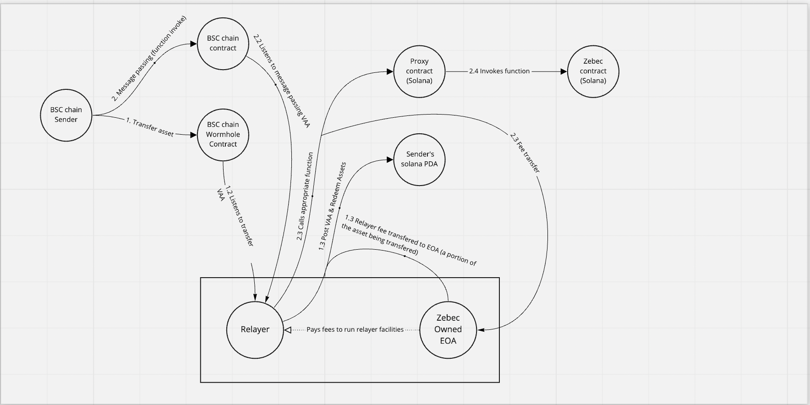

# Wormhole ZEBEC Program:

_Fig: Sender's Flow_

_Fig: Receiver's Flow_

## High level program flow :

1. Users on the BSCchain send their tokens to Solana via wormhole.

- The token is sent to a (ATA) PDA owned by the proxy contract
- User’s BSC chain address and BSC chain id are used as seeds for the PDA

2. Users will then invoke a function on the BSC chain.

- These functions will be the same functions available to users provided by Zebec streaming.
- The function call on the BSC chain is just a message passing that will allow the users to send the function parameters from the BSC chain.

3. The parameters sent over will be stored and will be used for validation later when the transaction is built.

- The concept of building and executing transactions is used to execute zebec native functions such as deploy, stream, and withdraw tokens.
